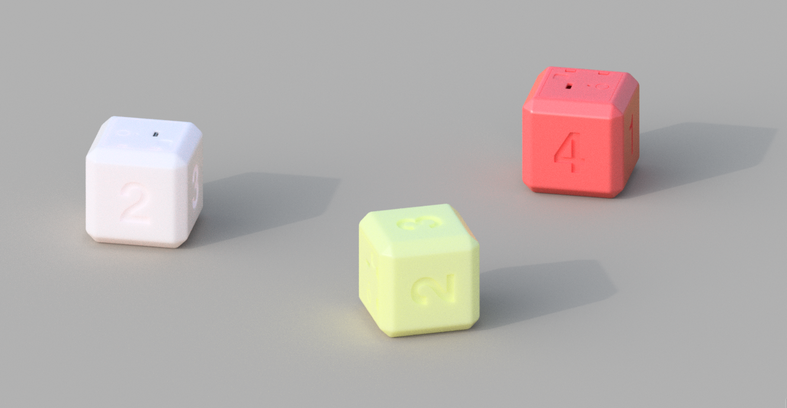
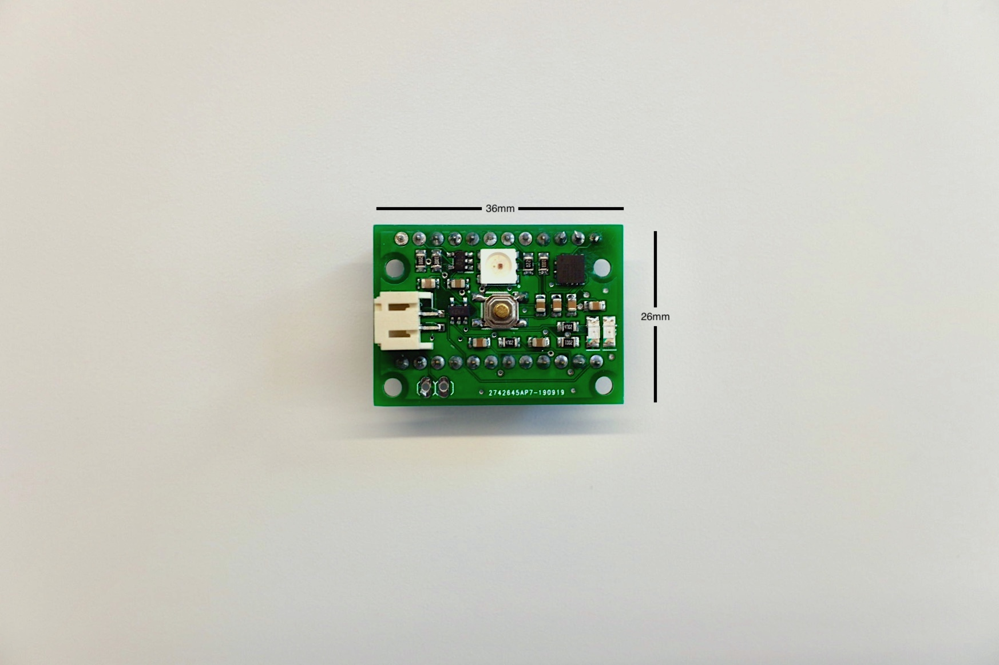
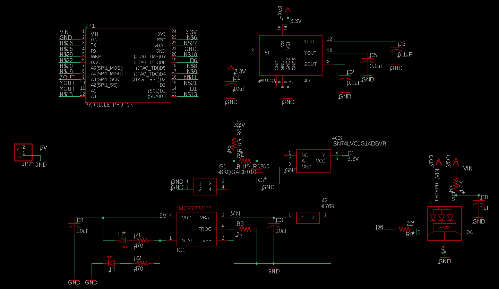
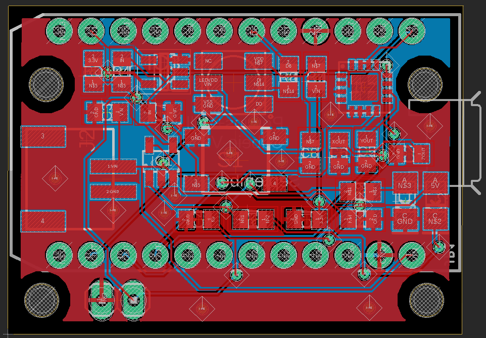

# Cubeio
An active meeting engagement tool designed to foster and facilitate decision-making, meaningful dialogue and equal input.


## Getting Started
If this is your first time using the particle, please refer to the [quickstart guide](https://docs.particle.io/quickstart/photon/). The following instructions are written for Mac. If you are using Particle's [web compiler](build.particle.io), search for the `Cubeio` library under libraries. 

### 1. Install [Particle CLI](https://docs.particle.io/tutorials/developer-tools/cli/)

```
$ npm install -g particle-cli
```

### 2. Create a new project

```
$ particle project create
```

### 3. Add library to your project
This should create the library scaffolding necessary to import the library from within your project directory. 

```
$ particle library add Cubeio
```

## Usage
Once you install the library through the Particle CLI, you should be ready to go.
```c++
#include "Cubeio.h"

Cubeio mycube(D6, D1, A1,A2,A3);
```
Your object declaration might be constructed differently depending on the hardware. Please view the hardware revision and pinouts under `/hardware`.
View the `/examples` and `/src` files to get detailed information about the library.

## Examples
There is a pretty handy script called `upload.sh` inside of every example. `upload.sh` puts the particle device in DFU mode, compiles the cpp file, and uploads the firmware to the device. Make sure that your cube's particle is connected via USB to your computer.
```bash
$ ./examples/set-calibration/upload.sh
```

## Hardware
Cubeio uses an Analog Devices [ADXL325](https://www.analog.com/media/en/technical-documentation/data-sheets/ADXL325.pdf) 3-axis accelerometer to calculate the roll and pitch (±5 g) of the cube, a Microchip [MCP73831](http://ww1.microchip.com/downloads/en/DeviceDoc/20001984g.pdf) Li-Polymer charge managment controller, a Worldsemi [WS2812](https://cdn-shop.adafruit.com/datasheets/WS2812.pdf) RGB LED, a single [Schmitt-Trigger](https://datasheet.lcsc.com/szlcsc/ON-Semicon-ON-MC74VHC1G14DTT1G_C242264.pdf) inverter, and a button among other hardware components.
Please view the hardware revision and pinouts under `/hardware`.
You can use this library with any microcontroller if you are using an ADXLxxx chip on its own. You may set the analog pins to your microcontroller and it will work the same. This is intended for the cubeio hardware, so there are no default values set in the `Cubeio object()` object. This library will work for [this](https://www.adafruit.com/product/163?gclid=Cj0KCQiAsdHhBRCwARIsAAhRhsntpFeWXqwBWQDJkoI_y_3HMDCfFyTddMOHF4XVeO5FmmmDFF6SohgaAoF2EALw_wcB) device from Adafruit.





## Contribution
I don't think that the Particle CLI allows branching/merging of libraries from multiple users. This may change, so for now you are welcome to submit pull requests and i will publish the changes.